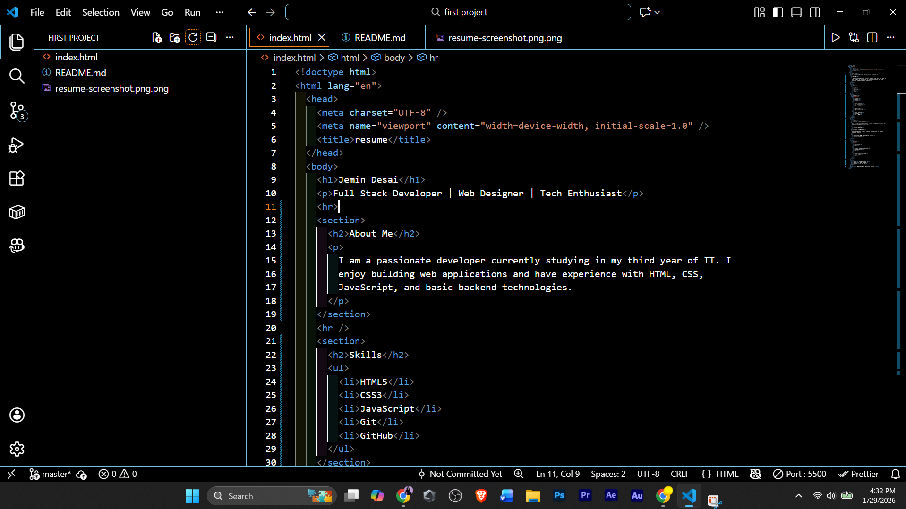
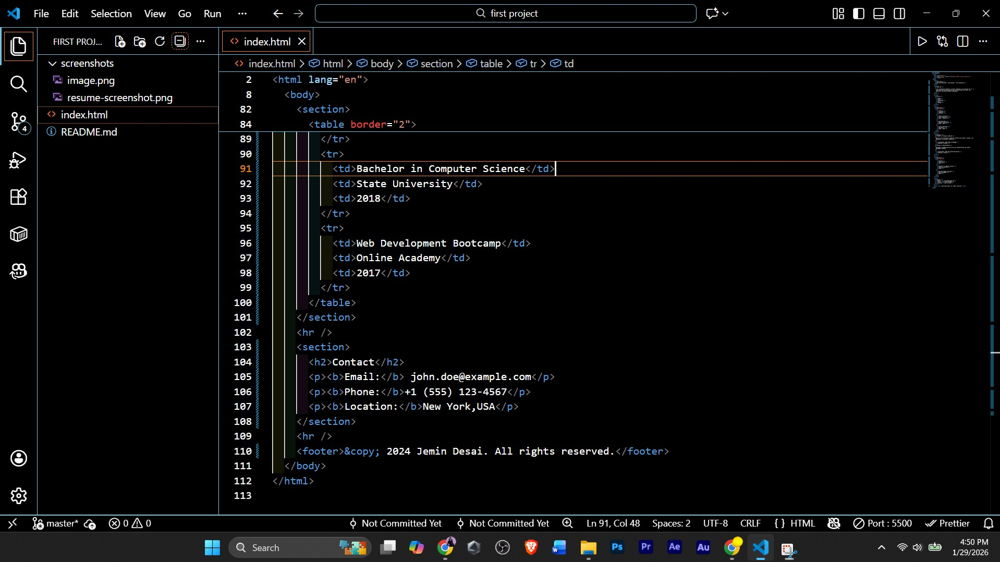

# HTML Resume Page

## 📄 Project Overview

This project is a **single-page resume website built using only HTML**.  
It follows proper HTML structure and semantic elements to represent a professional resume layout.

The page includes sections such as:

- Header and personal details
- About Me
- Skills
- Experience
- Projects
- Education
- Contact Information

---

## 🛠 Technologies Used

- HTML5

(No CSS or JavaScript used as per assignment requirement.)

---

## ▶️ How to Run the Project

1. Download or clone the repository.
2. Open the `index.html` file in any web browser (Chrome, Edge, Firefox).
3. See the screenshot at for reference.

No setup or installation required.

---

## 📸 Demo

## 👤 Author

**Jemin Desai**
